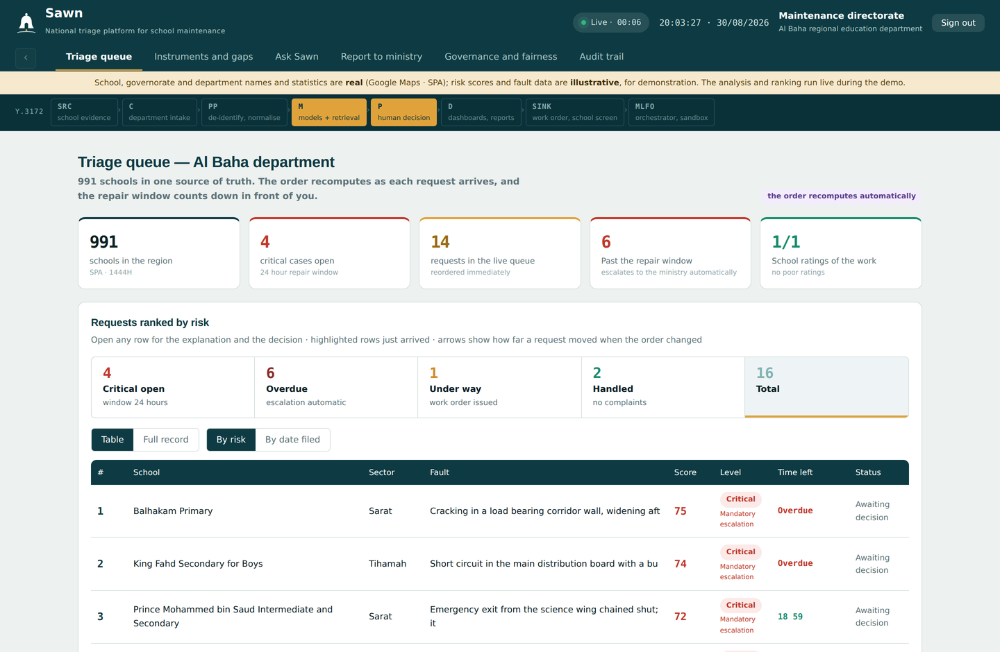
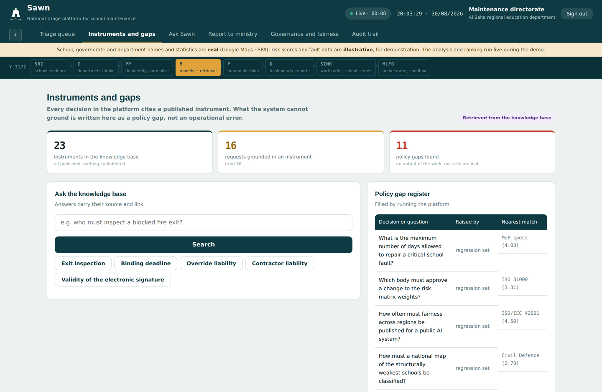
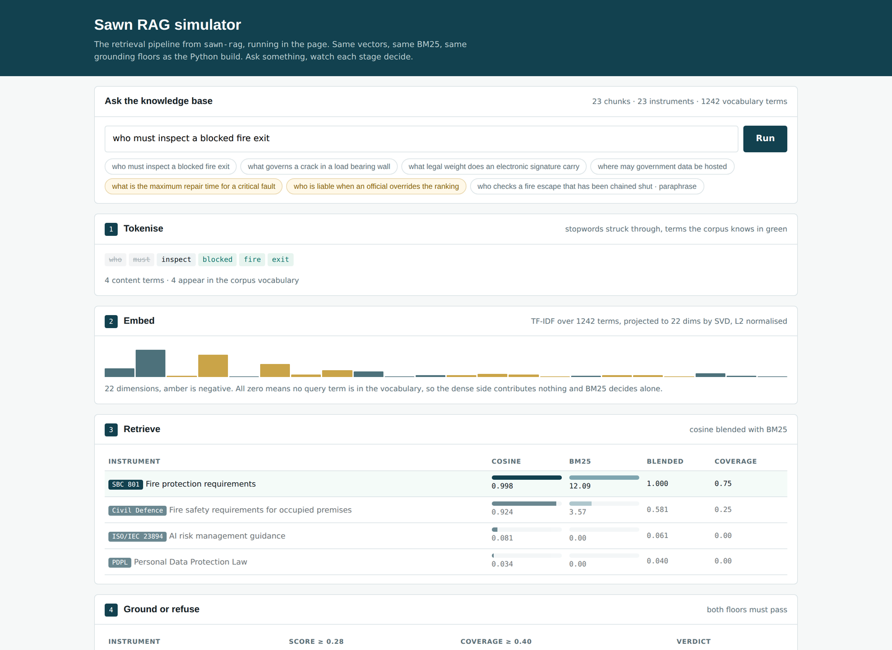
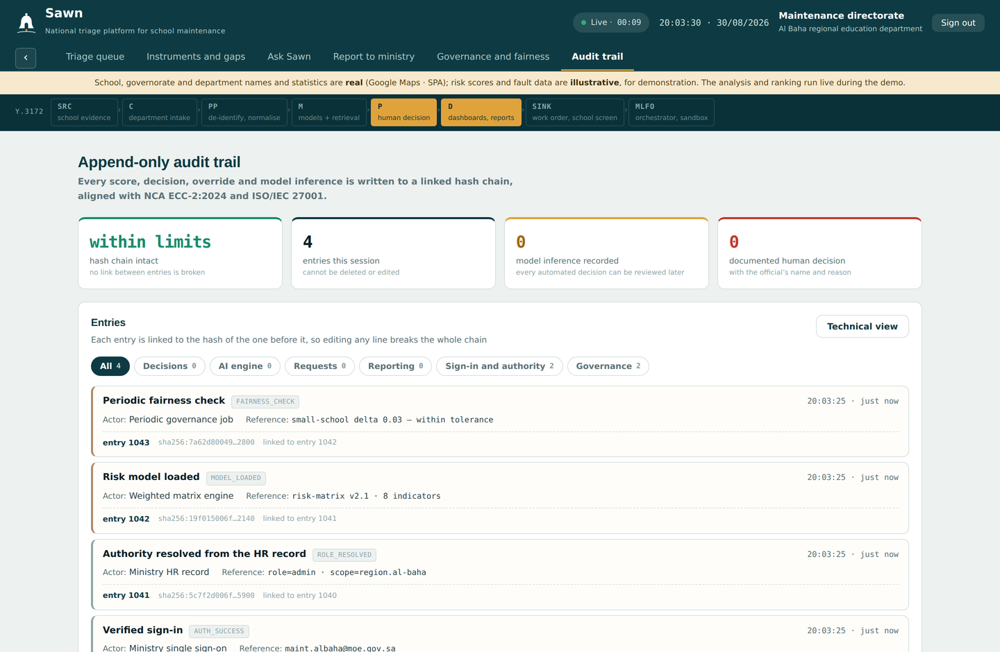

# Sawn · صَوْن

**A risk-based decision on school maintenance — not first come, first served.**

Saudi Arabia has roughly 24,000 public schools. Maintenance requests are worked in the
order they arrive, so a chained fire exit waits behind a broken air conditioner. Sawn
reads every request, scores it against a transparent risk matrix, and ranks the schools
that cannot wait first — and every ranking it produces cites the published instrument it
rests on. What no instrument covers is written to a policy gap register instead of being
guessed at.

Submitted to the **ITU AI Readiness Hackathon KSA 2026**, education track, by Team
Crescent. Reference deployment: the Al Baha regional education department, chosen because
its two sectors — the Sarat highlands and the Tihamah lowlands — fail in opposite ways and
stress the risk model from both ends.

[](https://github.com/shyuix/SAWN/actions/workflows/verify.yml)
[](LICENSE)

## Try it

| | |
|---|---|
| **Platform** | https://sawn-demo1.netlify.app/ |
| **RAG simulator** | https://rag-simulator-sawn1.netlify.app/ |
| **Wireframes (Figma)** | [Sawn · Wireframes](https://www.figma.com/design/sUfzQYwlMIfq97aNy0BXbu/Sawn%C2%B7-Wireframes?node-id=0-1&t=1VIIBII4ecNhfgrk-1) |
| **Demo video** | *link to follow* |
| **Technical report** | [`docs/Sawn_Report.docx`](docs/Sawn_Report.docx) |

Both pages are single HTML files. Nothing is installed, no key is needed, and nothing
leaves the browser.



## What it does

Three roles share one source of truth. A **school principal** files a fault and sees where
their school stands in the national queue. An **education department** works the ranked
queue, opens any row for the explanation behind the score, and overrides it on the record
if they disagree. The **ministry** sees the national picture and where the risk is
concentrated.

Ranking is a dual score: 40% of the overall condition burden plus 60% of the single worst
life-safety hazard, so one severe indicator cannot be averaged away by six mild ones. A
structural or electrical or fire indicator at 8 or above is escalated to Critical
regardless of what the arithmetic says.

Every score, decision, override and inference is appended to a linked hash chain, so an
entry cannot be edited without breaking the chain after it. Handovers are signed
electronically under the Electronic Transactions Law.

The build maps to **ITU-T Y.3172** clause 8.1 node by node, and draws on Saudi Building
Code SBC 201/401/801, Civil Defence requirements, MoE facility specifications, PDPL, NDMO,
the SDAIA AI ethics principles, NCA ECC-2:2024 and CCC-1:2020, and ITU-T Y.3173, Y.3174
and Y.3181. All 23 are listed in [`kb/sources.json`](kb/sources.json) and described in
[`docs/knowledge-base.md`](docs/knowledge-base.md).



## Why the refusal matters more than the answer

A retriever always returns its closest match. Ask it something no instrument covers and it
returns the nearest topic anyway; a generator turns that into a confident sentence with a
code in brackets after it. Here that is not a small error — it invents a legal obligation,
and the school it is quoted at has no way to tell.

So the index has to be able to say nothing. Two floors decide it, and both must pass:

- **score floor** — the blended dense and lexical score
- **coverage floor** — the share of the question's content words that appear in the
  retrieved chunk

A high score with almost no term overlap means the question drifted into a neighbouring
topic, which is exactly the case that produces a confident wrong citation. The floors were
set by sweep, not by taste: at a coverage floor of 0.34 the index cites ISO 42001 for a
question about publishing fairness reports, which that standard does not require. At 0.40
it refuses, and refusing is correct.

Anything refused lands in the gap register. That register is the policy gap register the
submission argues from — gaps produced by running the system, not asserted in a document.

### Two grounding rules in the platform, and why

The platform asks the index two different kinds of question, and one threshold cannot
serve both.

- A **fault description** ("Cracking in a load bearing corridor wall, widening after rain
  and shedding debris") is long, and most of its words are in no instrument. Coverage is
  inherently low, so lexical hits decide: score floor 1.1 and at least two content words
  shared with the instrument.
- A **policy question** ("Who is liable when the proposed ranking is overridden?") is
  short, and a single shared word must not produce a citation. Coverage decides: score
  floor 1.1 and coverage 0.40, the same coverage floor as the simulator.

Under the first rule every seeded fault type grounds in an instrument. Under the second,
all seven regression questions — one per policy gap in section 5 of the report — refuse,
and the internal deadline check refuses too, which is what writes *no instrument sets a
maximum repair time* to the register for every open request. Those questions are asked at
load, so the register is populated by running the code, not by hand.

## Results

The evaluation set holds 41 questions: 22 that a specific instrument answers, 7 that none
does, and 12 paraphrases. The 7 are not arbitrary — there is one for each policy gap in
section 5 of the report, so the two documents cannot drift apart. If a question here
starts being answered, the gap it probes has been closed by a new instrument and the
report needs updating.

| set | metric | value |
|---|---|---|
| 22 answerable | hit@1 | 0.955 |
| | hit@4 | 1.000 |
| | MRR | 0.977 |
| 7 uncovered | gap recall | 1.000 |
| 12 paraphrased | correct | 2/12 |
| | refused | 9/12 |
| | miscited | 1/12 |
| corpus | 23 instruments | 23 chunks |
| embedding | local LSA | 22 dims, 0.96 variance |

Gap recall is the share of uncovered questions the system refused rather than answered.
Every row is reproduced by `python3 cli.py eval`, and the same numbers appear in the
metrics strip of the simulator.

### Read the paraphrase row before quoting the first one

The 22 answerable questions share about 0.61 of their content words with the document they
are meant to find. That is not cheating, but it does mean hit@1 of 0.955 is measuring an
index that has seen the vocabulary before.

So there is a second set: the same instruments, asked the way a principal would actually
ask. *Who checks a fire escape that has been chained shut?* instead of *who must inspect a
blocked fire exit*. Performance falls to **2 correct out of 12**.

That fall is the honest measure of a lexical-semantic index on a small corpus. LSA learns
which words occur together in these 23 documents; it has no way to know that a fire escape
is a means of egress, because nothing in the corpus ever says so.

How it fails is worth as much as the number. Nine of the twelve were refused rather than
answered wrongly, so the floors held and the gap register caught them. One was miscited:
*where is government information allowed to live* returned Y.3181, the sandbox
recommendation, on the word "live". That is the failure mode this design exists to
prevent, and one in twelve is not prevented well enough. This is the case for a hosted
embedding model, stated with a number attached rather than as a preference. Swap the
backend and re-run the evaluation; the paraphrase row is the one that should move.



## Run the retrieval yourself

Python 3.8 or later. No dependencies, no network, no key.

```bash
python3 cli.py ask "who must inspect a blocked fire exit in a school?"
python3 cli.py ask "what is the maximum time allowed to repair a critical fault?"   # refuses
python3 cli.py eval
python3 tools/verify_index.py
```

`ask` answers from the 23-instrument corpus and cites every instrument it stands on, or
refuses and reports the nearest miss. `eval` recomputes the table above and exits non-zero
if any metric regresses, so it doubles as a regression test. `verify_index.py` is the
integrity check: it asserts the index inside the simulator is byte-identical to
`rag/index.json`, that `kb/sources.json` is the corpus that index was fitted over, that
every id the evaluation expects exists in the corpus, and then runs the evaluation. It is
what the CI badge at the top of this page runs on every push.

## Layout

```
app/
  sawn-platform.html          the product in one file: three roles, triage queue,
                              instruments and gaps, custody chain, signatures,
                              Y.3181 sandbox panel
  rag-simulator.html          the retrieval pipeline with its own controls, the
                              fitted index and the full evaluation set embedded
kb/sources.json               the corpus: 23 instruments, authority and link
rag/engine.py                 tokenise, encode, blend cosine with BM25, apply the
                              two floors, ground or refuse
rag/index.json                the fitted index the engine and the simulator share
eval/questions.yaml           22 answerable, 7 uncovered, 12 paraphrased
cli.py                        ask · eval
tools/verify_index.py         the integrity check described above
docs/                         technical report, knowledge base, demo
                              framework, demo script, subtitles, screenshots
```

The index is fitted offline — sentence-window chunking with one sentence of overlap,
TF-IDF over 1,242 terms, truncated SVD to 22 dimensions, L2 normalised at both stages,
fitted on this corpus alone — and shipped as `rag/index.json`. `rag/engine.py` loads and
applies it, which is why the CLI runs anywhere with nothing installed. The browser encodes
a query through the identical vocabulary, IDF weights and SVD components; encoder
agreement with scikit-learn is within 6e-4.

The three sliders in the simulator are the point. Drag the coverage floor down from 0.40
and the miscitation count climbs, because the index starts citing instruments that share a
stray word with the question. That is the argument for the threshold, shown rather than
asserted.



## What this is not

**The corpus holds restatements, not statute.** Each entry is a short description of an
instrument written for retrieval, with its authority and a link to the official text.
Nothing in `kb/sources.json` is a legal source and the file says so. Pointing the index at
the full published documents is the obvious next step; the chunker already handles longer
text.

**The embeddings are lexical-semantic, not transformer.** LSA on a 23-document corpus
captures co-occurrence, not paraphrase, and the paraphrase row above is what that costs.

**Arabic queries retrieve nothing.** The corpus is English only, so the index cannot serve
a question typed in Arabic even though the schools it serves work in Arabic. A bilingual
corpus, or an embedding model with Arabic coverage, is required before this is usable by
the people it is for. The report says the same.

**23 documents is a small corpus.** hit@1 of 0.955 on 22 questions is 21 correct and 1
not. Treat it as evidence the plumbing works, not as a claim about performance at national
scale.

**SBC 201 is the general building code.** Structural loading is SBC 301 and existing
buildings are SBC 901. The corpus cites 201 for structural damage because its structural
chapter applies 301 by reference; adding 301 and 901 as their own entries is scheduled
after submission, because it refits the index and moves the numbers above.

**School and department names and statistics are real; risk scores and fault data are
illustrative.** The platform says so on every screen.

## Team

Team Crescent — Al-Baha University.
Shahad Helal Alghamdi (information technology) · Reem Helal Alghamdi (nursing).

## License

MIT — see [LICENSE](LICENSE). The instruments cited remain the property of their issuing
authorities; the links in `kb/sources.json` point to the official text.
